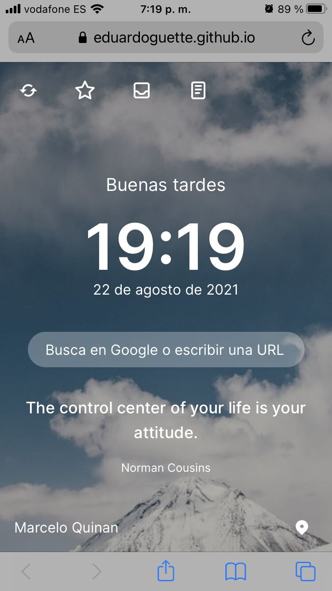
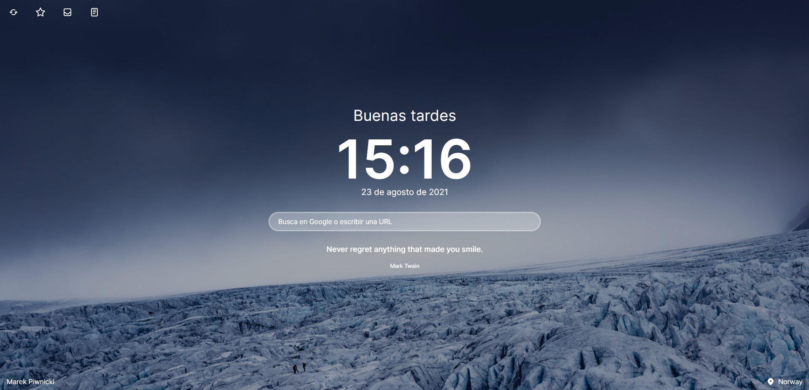

# Start Home

## Tabla de contenido

- [Descripción](#descripción)

- [Desafío](#desafío)

- [Screenshots](#screenshot)

- [Links](#links)

- [My process](#my-process)

- [Construido con](#construido-con)

- [Instalación](#instalación)

## Descripción

Es una página de inicio rápido, donde además de ser un buscador, podrás guardar notas y al mismo tiempo tener hermosos paisajes de fondo.
 
 
¡Sácale el máximo a tu productividad con este proyecto!

### Desafío
 
Crear una pagina de inicio, que contenga un buscador y a su vez tenga notas rapidas.

Clonar https://demo.muetab.com/.

- Agregar y quitar funciones

- Mejorar breakpoints

### Screenshot

### Links

- [Live Site URL](https://start-home.netlify.app/)

### Construido con

- HTML5

- CSS

- Tailwind 

- Mobile-first workflow

- JavaScript

- Animate.css

### Instalación

1. Ejecuta `npm install` para instalar dependencias.
2. Usa `npm run dev` para el entorno de desarrollo.
3. Ejecuta `npm run build` para construir la versión de producción.
4. Para desplegar la app con Vite, sube el contenido de `dist` a tu servidor o revisa la [guía de despliegue](https://vitejs.dev/guide/static-deploy.html).
